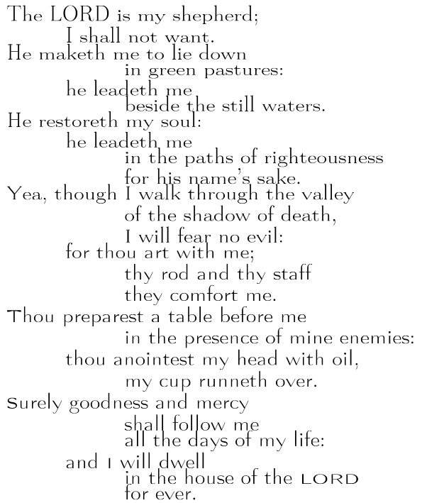

# fontmorph

A shell script to interpolate between two METAFONT styles based on Donald Knuth's 1982 ["The Concept of a Meta-Font"](https://journals.uc.edu/index.php/vl/article/view/5329/4193)

## Note

This script is more of a template than a tool, right now it's set up for Computer Modern Roman. 
The general structure will work for other METAFONT fonts, but it will need tweaking.
Also, newlines are not allowed in `contents.txt`, the example was tweaked after generation.
